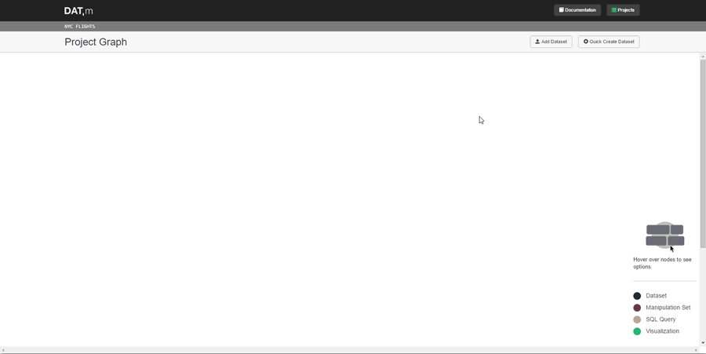

.. datm documentation master file, created by
   sphinx-quickstart on Wed Jan 25 13:29:50 2017.
   You can adapt this file completely to your liking, but it should at least
   contain the root `toctree` directive.

What is Datm?
=============

Datm is a graph-based, in-browser, data manipulation and visualization application. It's written in Python and uses the
django web framework. In Datm, datasets and transformations on datasets are graph nodes. A transformation has an edge
from its "parent dataset" and an edge to its "child dataset".

See the :doc:`tutorial` for an overview of Datm's features.

Add Datasets
------------

.. include:: images/demo_gifs/browser_window.png

.. raw:: html

    

         

         

    

Transform Datasets
------------------

Join Datasets
-------------

Contents:

.. toctree::
   :maxdepth: 2

   getting-started
   tutorial
   project-graphs
   datasets
   transformations
   manipulation-expressions
