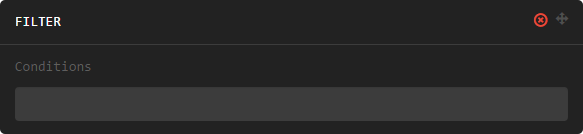

#################
Manipulation Sets
#################

Manipulation sets are similar to chained "data manipulation verb" functions from the `dplyr` R package. They
are ordered sets of instructions that are applied to the parent dataset one at a time (i.e function composition).

******************
Manipulation Types
******************

Manipulation types correspond to common data manipulation tasks.

======
Filter
======

The `filter` manipulation subsets data based on the provided conditions. It takes one or more comma separated
`manipulation expressions <http://datm.readthedocs.io/en/latest/manipulation-expressions.html>`_. as its argument.

+-----------------------+-------------+
| Input Parameter       | Description |
|                       |             |
+=======================+=============+
| body row 1, column 1  | column 2    |
+-----------------------+-------------+
| body row 2            | ...         |
+-----------------------+-------------+