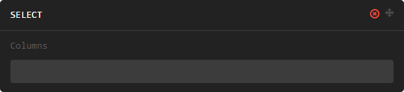

###############
Transformations
###############

Introduction

Manipulation Sets
=================

Manipulation sets are similar to chained "data manipulation verb" functions from the excellent `dplyr` R package. They
are ordered sets of instructions that are applied to the parent dataset one at a time.

Manipulation Types
------------------

Manipulation types correspond to common data manipulation tasks.

Filter
~~~~~~

The `filter` manipulation subsets data based on the provided conditions.

.. image:: images/manipulation_types/filter.png

.. function:: filter(conditions)

   Return only rows meeting given conditions

   :param conditions: One or more conditional statements separated by commas.

Select
~~~~~~

The `select` manipulation subsets the dataset, keeping only those columns given.

.. function:: select(columns)

   Keeps only the selected columns.

   :param columns: Comma separated list of column names.

Example
^^^^^^^

.. image:: images/manipulation_types/select_ex_1.png

Create
~~~~~~

The `create` manipulation allows new columns to be defined, or existing columns to be altered.

.. image:: images/manipulation_types/create.png

.. function:: create(column_name, column_definition)

   Creates a new column or alters/replaces existing column.

   :param column_name: The name of the column to create/alter.
   :param column_definition: Expression definition column...

SQL Queries
===========

...

